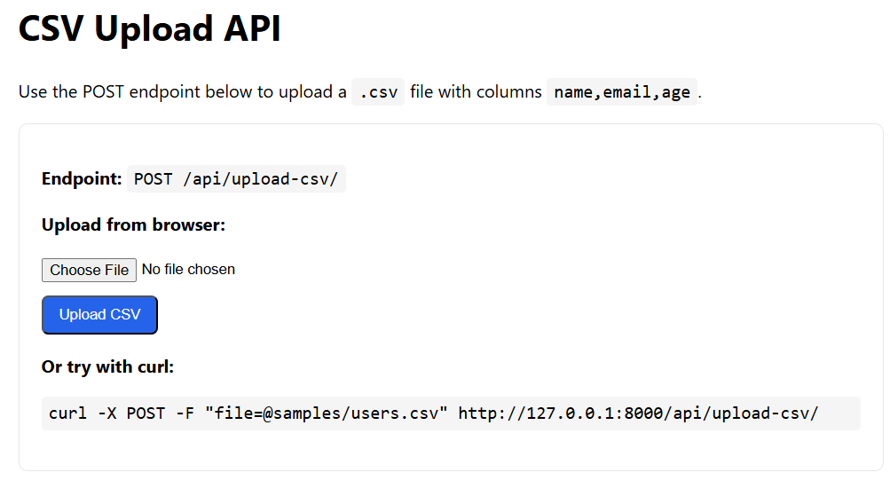
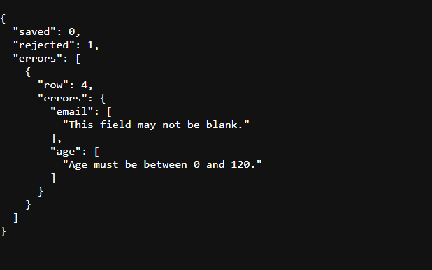

# Task 1: CSV Upload API

## Overview
A Django REST Framework API endpoint that processes user data from CSV files.This task demonstrates building APIs, handling file uploads, validating data,and interacting with a database.

## Requirements Met
 POST endpoint for uploading CSV files  
 CSV parsing and validation based on rules:
   - name:must be a non-empty string
   - email: must be a valid email address
   - age: must be an integer between 0 and 120
 valid records saved to User model  
 JSON response with:
   - total number of records successfully saved
   - Total number of records rejected
   - Detailed validation errors for rejected records
 Only accepts `.csv` files  
 Duplicate email addresses gracefully skipped  
 Uses DRF serializers for validation  
 Includes unit tests

## Setup

1. Create and activate a virtual environment (Windows):
```bash
py -m venv .venv
.venv\Scripts\activate
```

2. Install dependencies:
```bash
pip install -r requirements.txt
```

3. Apply migrations:
```bash
python manage.py migrate
```

4. Run tests:
```bash
python manage.py test users.tests
```

5. Run the server:
```bash
python manage.py runserver
```


## API Endpoint

- **URL**: `POST /api/upload-csv/`
- **Content-Type**: `multipart/form-data`
- **Field**: `file` (must be a `.csv` file)

### CSV Schema
The csv file must have the following columns:
- name: non-empty string
- email: valid email address
- age: integer between 0 and 120

### Expected Behavior
- Valid rows are saved to the `users.User` model
- Duplicate emails (existing in DB or repeated in file) are skipped without errors
- Response JSON includes counts and detailed errors

### Sample Request

**Using curl:**
```bash
curl -X POST \
  -F "file=@samples/users.csv" \
  http://127.0.0.1:8000/api/upload-csv/
```

**Using browser:**
1. Open http://127.0.0.1:8000/
2. Select a CSV file using the upload form
3. Click "Upload CSV"

### Sample Response
See `samples/sample_response.json` for an example response.

Example:
```json
{
  "saved": 2,
  "rejected": 1,
  "errors": [
    {
      "row": 4,
      "errors": {
        "email": ["This field may not be blank."],
        "age": ["Age must be between 0 and 120."]
      }
    }
  ]
}
```
## Screenshot


## Implementation Details

### Model
- User model with fields: name, `email` (unique), age
- Email uniqueness enforced at database level

### Serializer
- `UserSerializer` validates:
  - Name is non-empty after stripping whitespace
  - Email format is valid
  - Age is integer between 0 and 120
- Unique validator disabled on email to allow graceful skipping in view

### View
- `UploadCSVView` handles:
  - File extension validation (`.csv` only)
  - UTF-8 encoding validation
  - CSV parsing with `csv.DictReader`
  - Column validation (requires `name`, `email`, `age`)
  - Row-by-row validation using serializer
  - Duplicate email detection (skips gracefully)
  - Bulk creation for performance
  - Response with summary statistics

### Error Handling
- Invalid file extensions return 400
- Missing columns return 400
- Invalid rows are collected and returned in response
- Duplicate emails are skipped (not counted as errors)

## Testing

Run all tests:
```bash
python manage.py test
```

Run only Task 1 tests:
```bash
python manage.py test users.tests
```

### Test Coverage
-  Valid CSV upload
-  Invalid rows handling
-  Duplicate email skipping
-  Non-CSV file rejection

