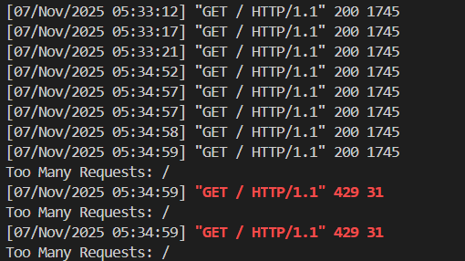

# Task 2: Rate Limiting Middleware

### Overview
A custom Django middleware that implements IP-based request rate limiting using a rolling 5-minute window. This task demonstrates working with Django middleware, caching systems, and efficient request handling.

### Requirements Met
 Middleware tracks requests by IP address  
 Blocks requests exceeding 100 requests in a rolling 5-minute window  
 Returns HTTP 429 (Too Many Requests) for blocked IPs  
 Uses Django middleware format (`MiddlewareMixin`)  
 Stores request data in Django cache framework  
 Includes headers indicating remaining allowed requests  
 Handles high-traffic scenarios efficiently  

### Setup

The middleware is already configured in `assessment/settings.py`. No additional setup required beyond the main project setup.

#### Configuration

Rate limiting settings in `assessment/settings.py`:
```python
RATE_LIMIT_MAX_REQUESTS = 100        # Max requests per window
RATE_LIMIT_WINDOW_SECONDS = 300      # Window duration (5 minutes)
RATE_LIMIT_CACHE_PREFIX = "rlip:"   # Cache key prefix
```

For testing, you can temporarily reduce these values:
```python
RATE_LIMIT_MAX_REQUESTS = 5
RATE_LIMIT_WINDOW_SECONDS = 30
```

## How It Works
### Rolling Window Algorithm
1. Each IP address has a list of request timestamps stored in cache
2. On each request:
   - load timestamps from cache
   - remove timestamps older than the window (now - window_seconds)
   - If count >= max_requests, block with HTTP 429
   - Otherwise, add current timestamp and save to cache
3. Cache entries expire after window_seconds, providing automatic cleanup

### Response Headers
Every response includes:
- X-RateLimit-Limit: Maximum requests allowed in the window
- X-RateLimit-Remaining: Number of requests remaining in current window
- X-RateLimit-Reset: Seconds until the window resets

When blocked (HTTP 429), additional header:
- Retry-After: Seconds to wait before retrying

### Testing

### Automated Tests
Run rate limiting tests:
```bash
python manage.py test users.tests_rate_limit
```

### Manual Testing

**1. Browser Testing:**
1. Start server: `python manage.py runserver`
2. Open http://127.0.0.1:8000/
3. Refresh the page multiple times quickly
4. After exceeding the limit, you'll see HTTP 429
5. Check browser DevTools Network tab for rate limit headers

**2. Curl Testing:**
```bash
# Make multiple requests
for /l %i in (1,1,10) do curl -i http://127.0.0.1:8000/
# Check headers
curl -i http://127.0.0.1:8000/
```


## Screenshots


## Implementation Details

### IP Detection
- Checks X-Forwarded-For header (first IP) if present
- Falls back to REMOTE_ADDR
- Useful for apps behind proxies/load balancers

## Example Output

**Normal Response (200 OK):**
```
HTTP/1.1 200 OK
X-RateLimit-Limit: 100
X-RateLimit-Remaining: 95
X-RateLimit-Reset: 287
```

**Rate Limited (429 Too Many Requests):**
```
HTTP/1.1 429 Too Many Requests
Retry-After: 45
X-RateLimit-Limit: 100
X-RateLimit-Remaining: 0
X-RateLimit-Reset: 45

{"detail": "Too Many Requests"}
```


